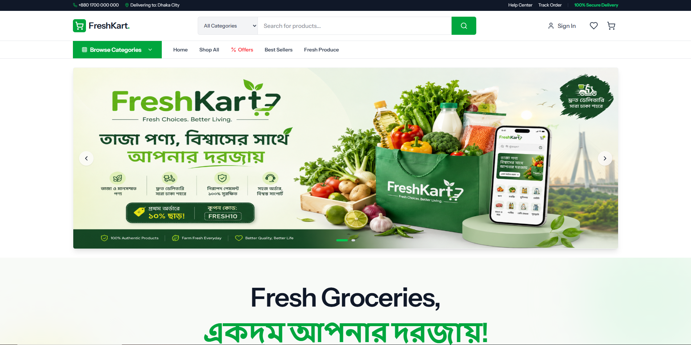

# FreshKart - Premium Grocery E-commerce Platform

FreshKart is a modern, full-featured grocery e-commerce application built with **Laravel**, **React (Inertia.js)**, and **Tailwind CSS**. It provides a seamless shopping experience with a premium aesthetic and a robust admin management system.

## 📸 Demo


## ✨ Key Features
- **Modern Storefront**: Responsive design with smooth sliding banners and premium UI/UX.
- **Product Management**: Category-based filtering, search, and trending/offers logic.
- **Shopping Experience**: Integrated Cart, Wishlist, and multi-step Checkout.
- **Admin Dashboard**: Comprehensive management of categories, products, and orders.
- **Secure Authentication**: Modernized auth flow (Login, Register, Password Reset).

## 🚀 Getting Started

1. **Clone the repository**
2. **Install dependencies**:
   ```bash
   composer install
   npm install
   ```
3. **Setup environment**:
   - Create `.env` from `.env.example`
   - Setup your database and run:
   ```bash
   php artisan migrate --seed
   ```
4. **Run the application**:
   - Backend: `php artisan serve`
   - Frontend: `npm run dev`

